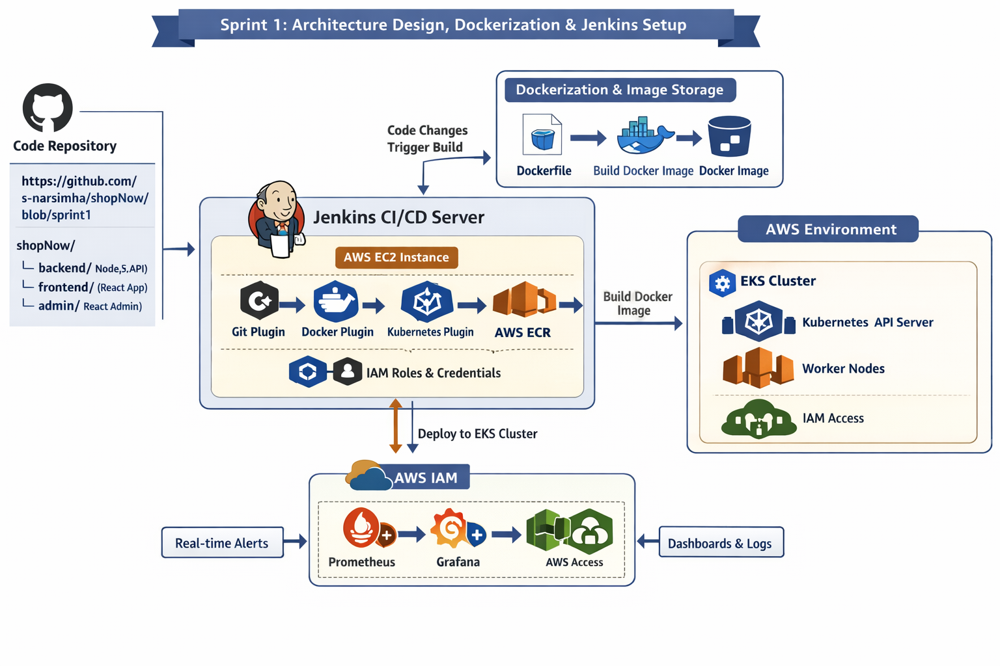

# Sprint 1 Architecture Design, Dockerization, and Jenkins Setup

## Tasks:
  - Design the application architecture for deployment on AWS EKS.
  - Dockerize the web application by creating a Dockerfile and storing the image in AWS ECR.
  - Set up a Jenkins server on AWS EC2 and configure necessary plugins (Docker, Kubernetes, AWS CLI).
  - Configure Jenkins to access EKS and AWS resources using credentials and AWS IAM roles.
  - Set up Git integration for Jenkins to trigger builds based on code changes.

Goal: Complete the application architecture, Dockerize the application, and establish a Jenkins server for CI/CD.

`https://copilot.microsoft.com/th/id/BCO.ca55ce52-6333-4354-b585-581aa72a0c40.png`

---

### ✅ Sprint 1 Architecture Scope

#### 🧩 Components Involved
- **GitHub Repo**: [shopNow](https://github.com/s-narsimha/shopNow/blob/sprint1)
  - `backend/` → Node.js API
  - `frontend/` → React customer app
  - `admin/` → React admin panel

#### 🛠️ Jenkins CI/CD Server (on AWS EC2)
- **Installed Plugins**:
  - Git Plugin → Pull source code and trigger builds
  - Docker Plugin → Build Docker images
  - Kubernetes Plugin → Prepare for EKS deployment
  - AWS CLI → Interact with AWS services
- **IAM Roles**:
  - EC2 instance assumes IAM role with access to EKS and ECR

#### 🐳 Dockerization
- **Dockerfiles** created for each app component
- Jenkins builds Docker images
- Images pushed to **AWS ECR**

#### ☁️ AWS EKS Cluster (Pre-configured)
- Kubernetes API Server
- Worker Nodes
- IAM access for Jenkins

### 🖼️ Architecture Diagram

https://copilot.microsoft.com/th/id/BCO.ca55ce52-6333-4354-b585-581aa72a0c40.png

### 🔧 Key Technologies
- GitHub for source control
- Docker for containerization
- AWS ECR for image storage
- Jenkins on AWS EC2 for CI/CD
- AWS IAM for secure access
- AWS EKS for Kubernetes deployment

### 🎯 Sprint 1 Goals Recap
- ✅ Design architecture for AWS EKS deployment
- ✅ Dockerize backend, frontend, and admin apps
- ✅ Set up Jenkins server with required plugins
- ✅ Configure Jenkins IAM access to AWS resources
- ✅ Integrate GitHub for build triggers
